# Ashenbell horizon benchmark gallery

Method identity is exposed here only for post-test analysis. Do not inspect before a blind session.

## R0 — Direct low-level

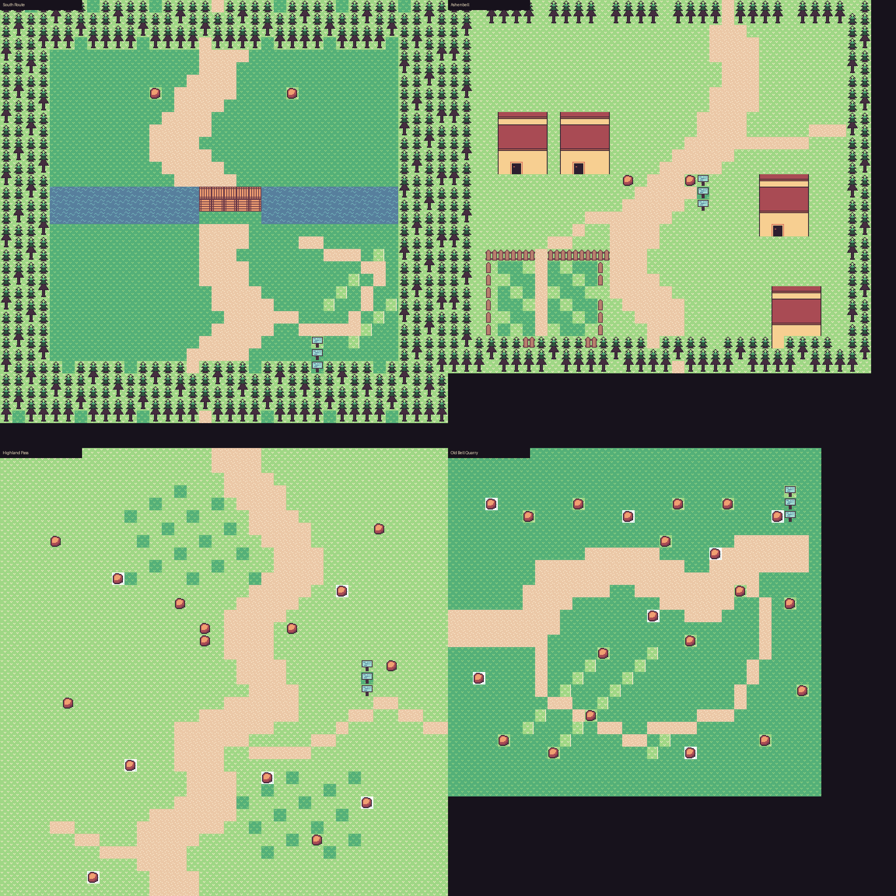

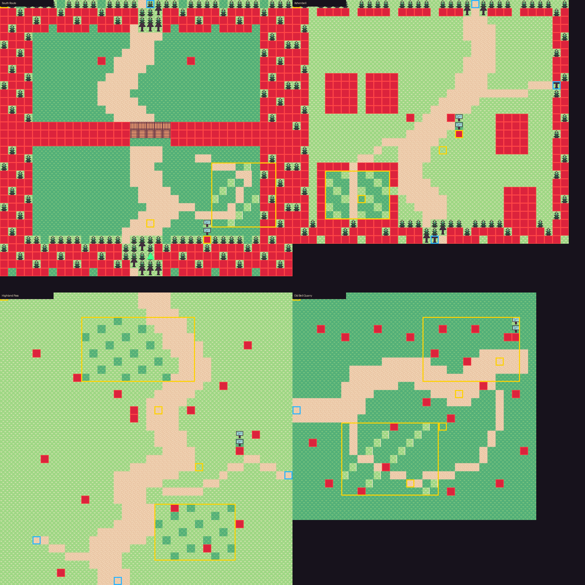

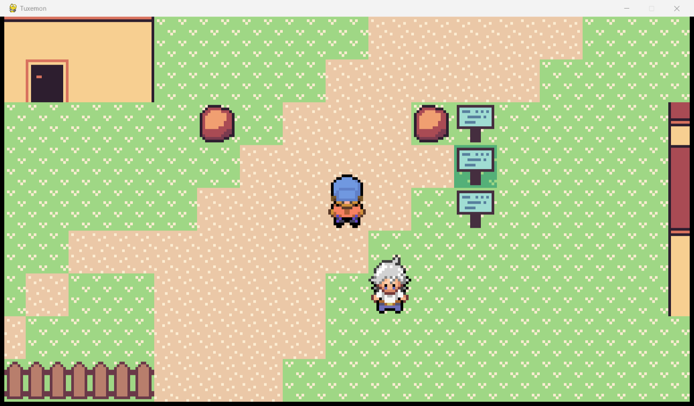

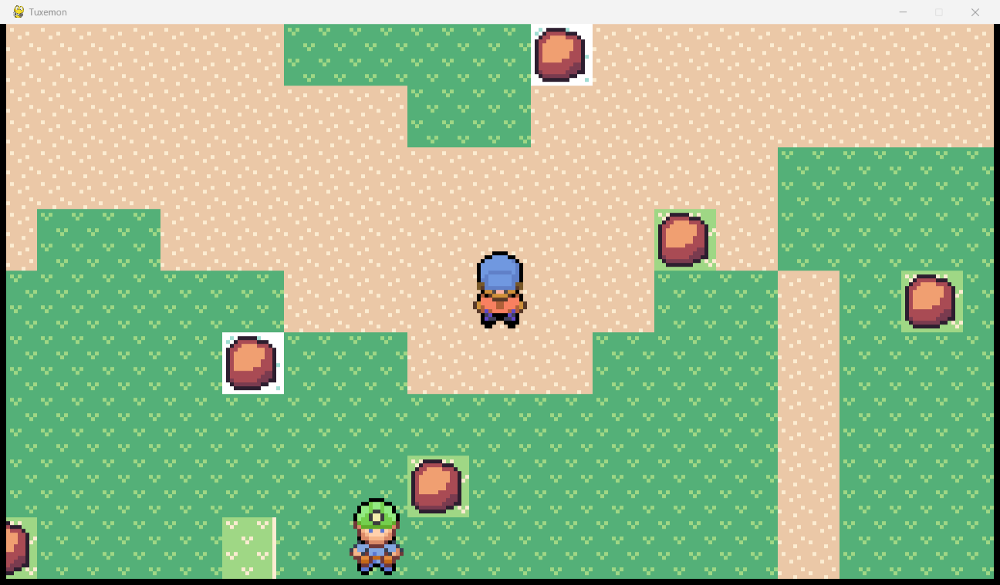

## R1 — One-shot WorldSpec

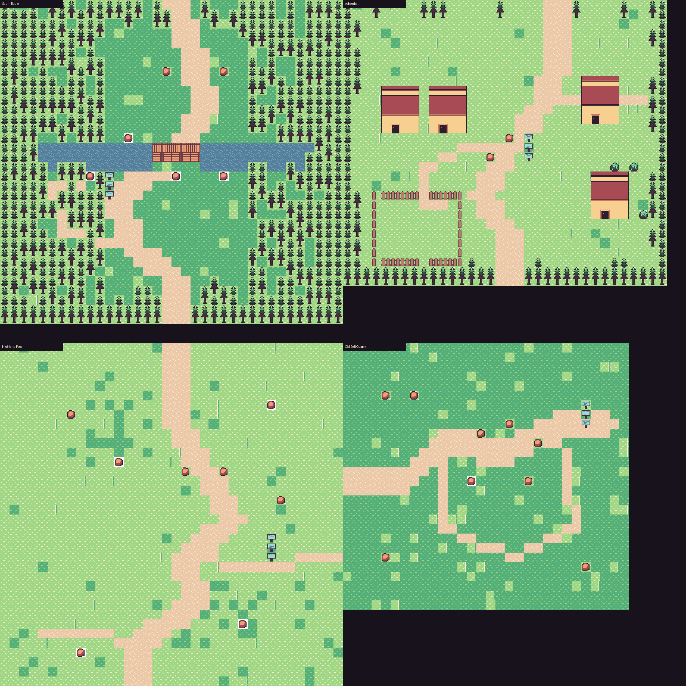

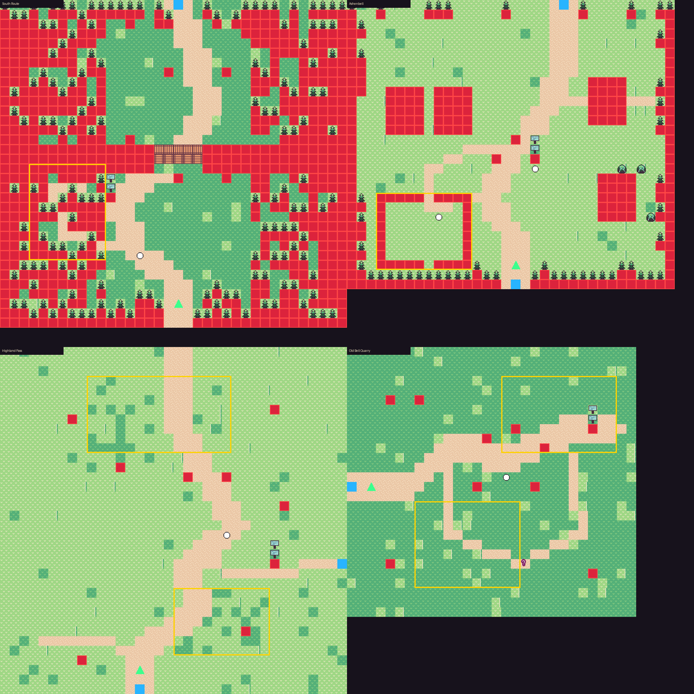

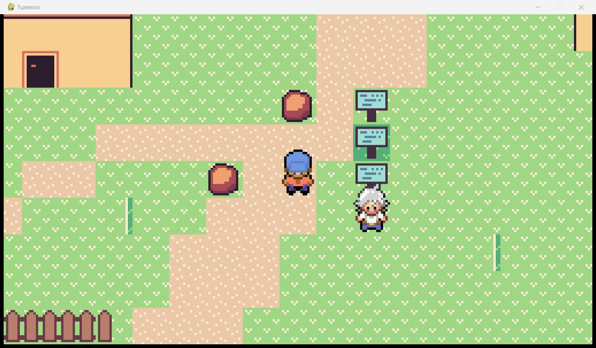

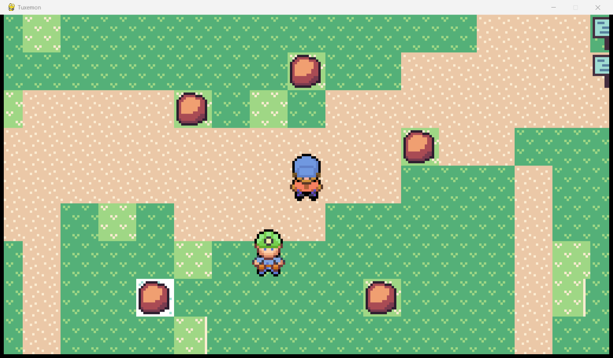

## R2 — Structured agentic

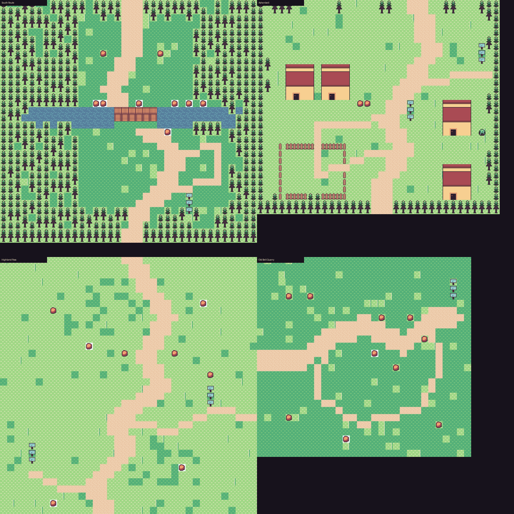

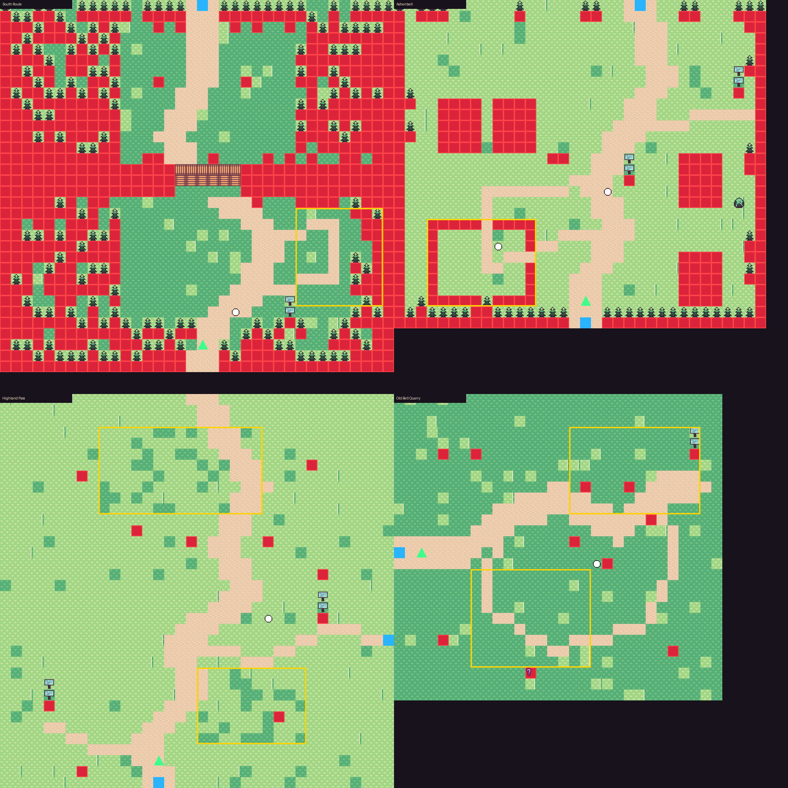

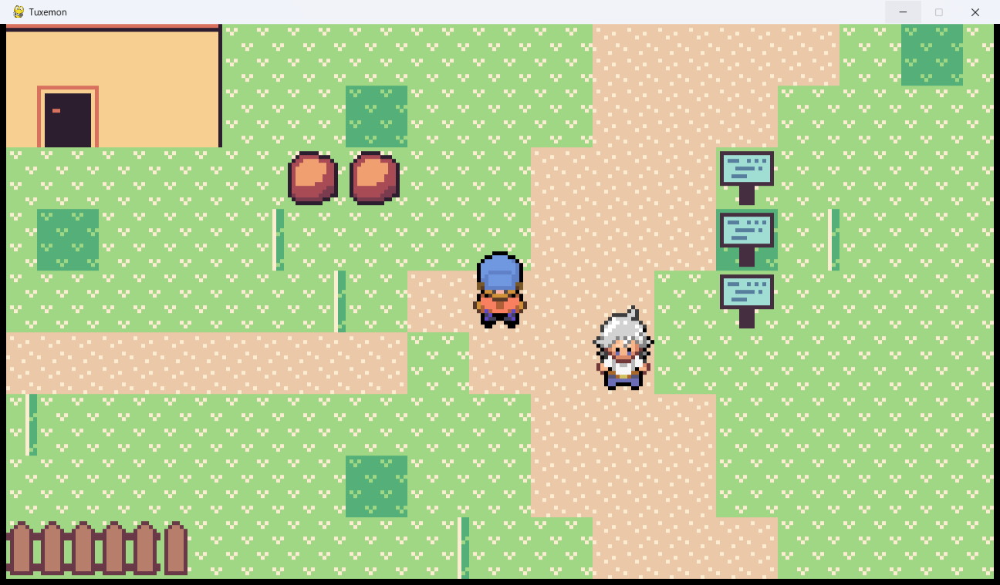

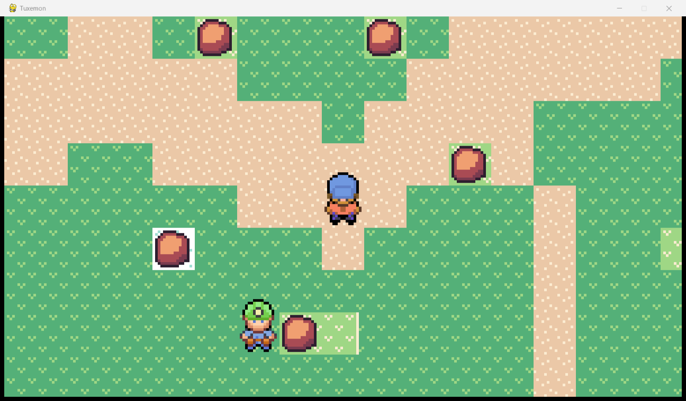

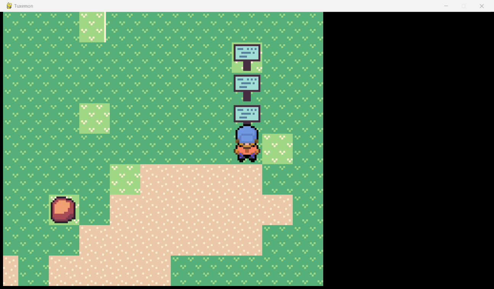
