# Deep Forest benchmark gallery

Method identity is exposed here only for post-test analysis. The blind
launcher masks these labels from players.

## A — Procedural

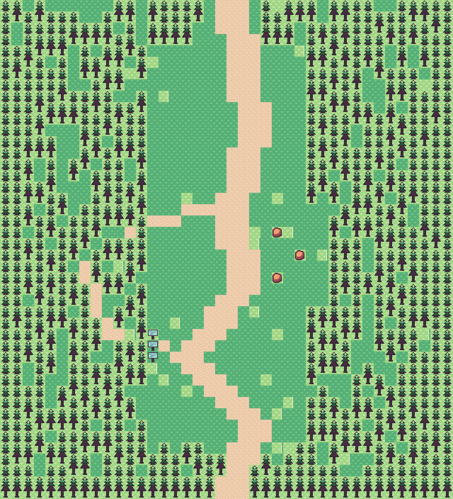

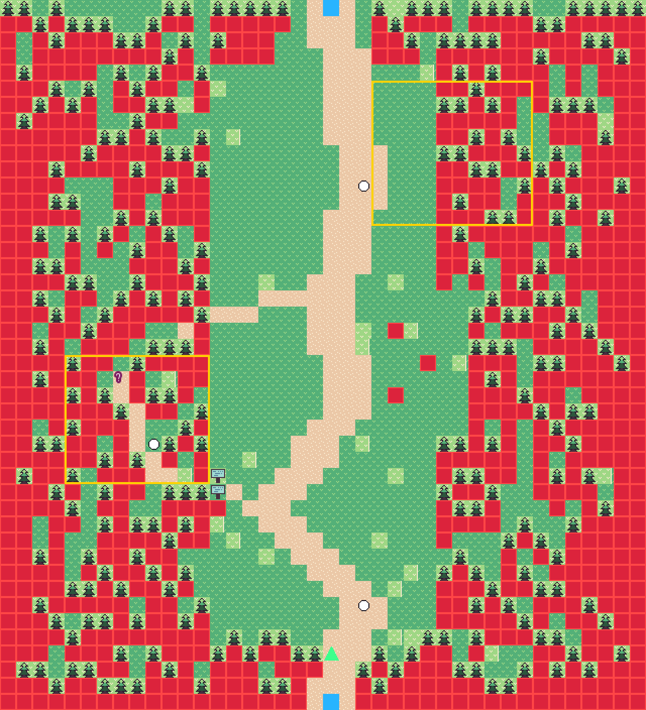

### In-game captures

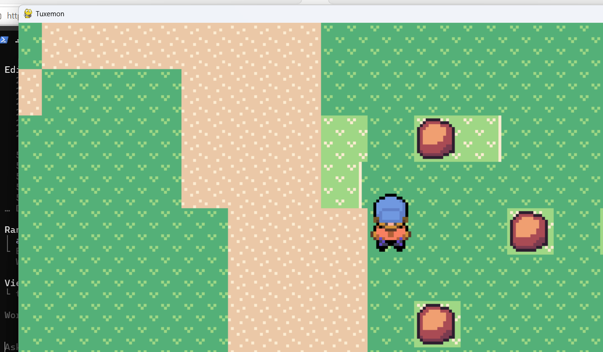

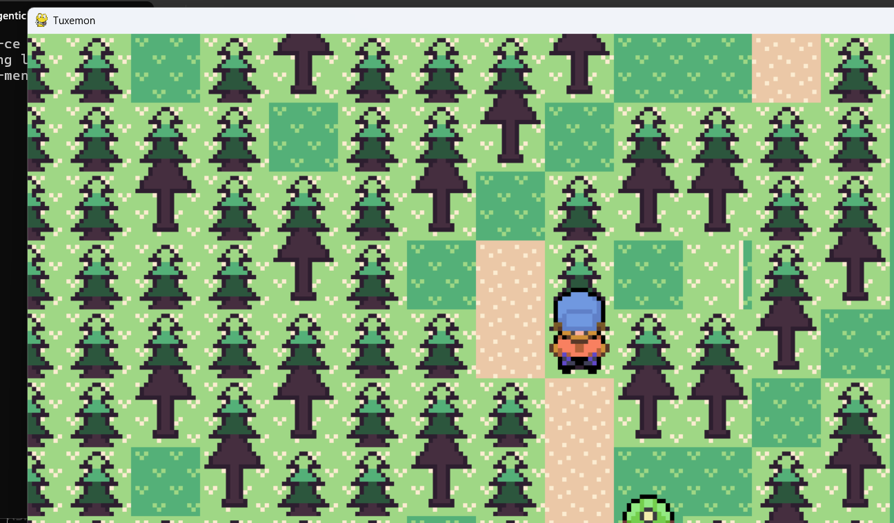

## B — One-shot

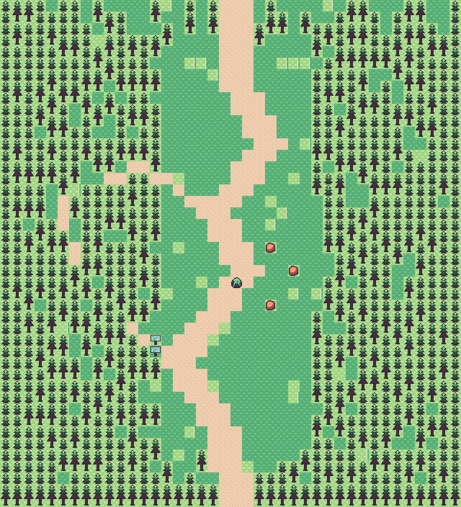

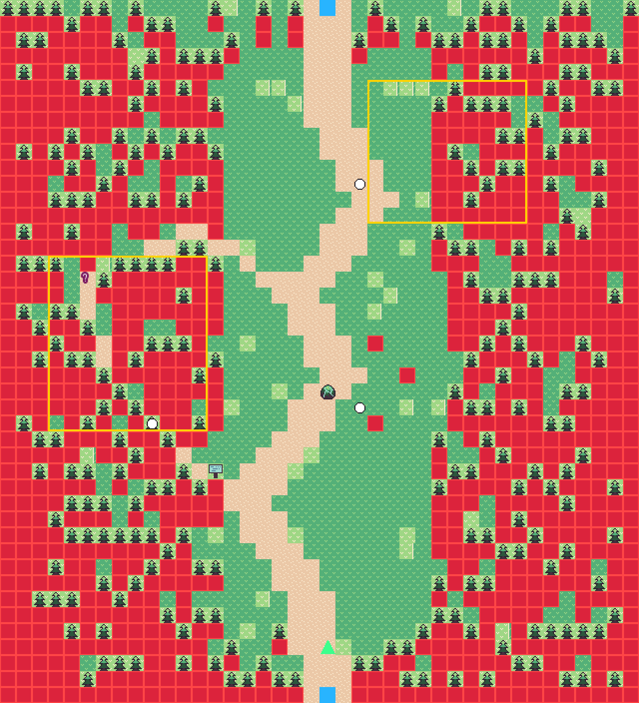

### In-game captures

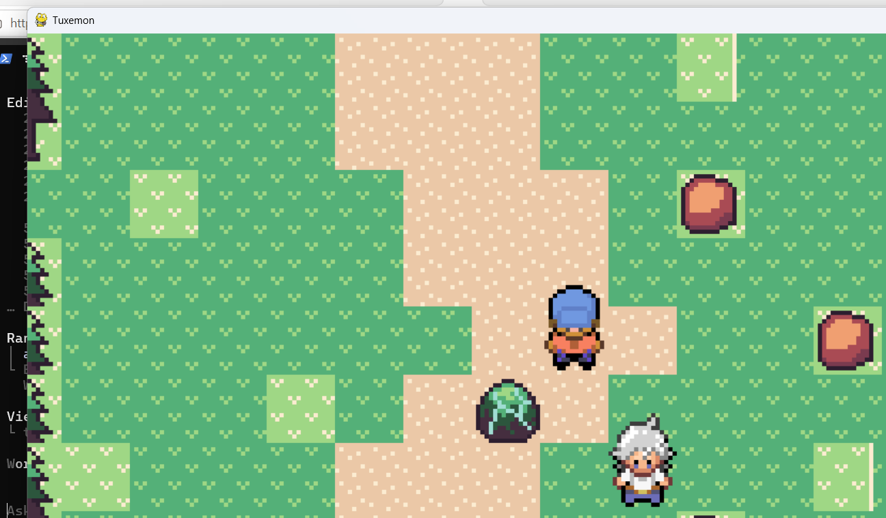

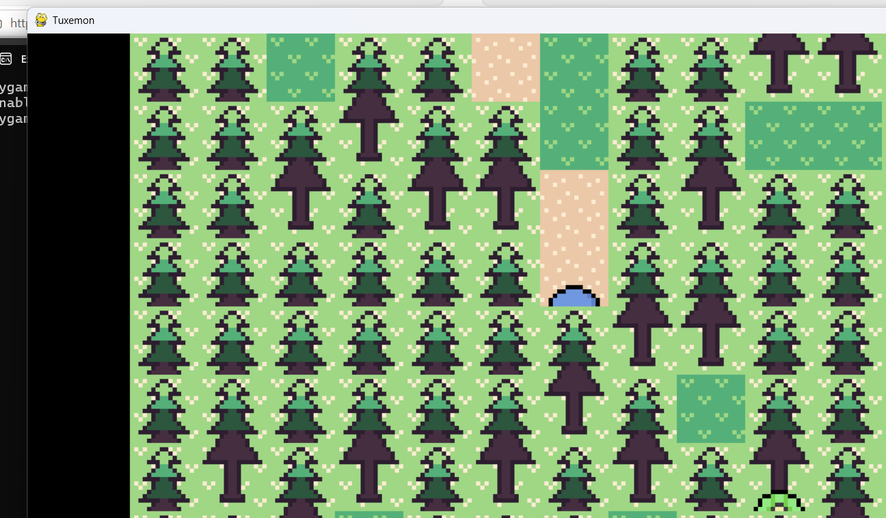

## C — Structured agentic

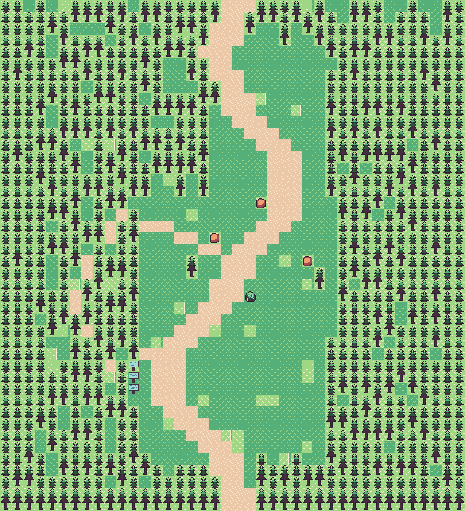

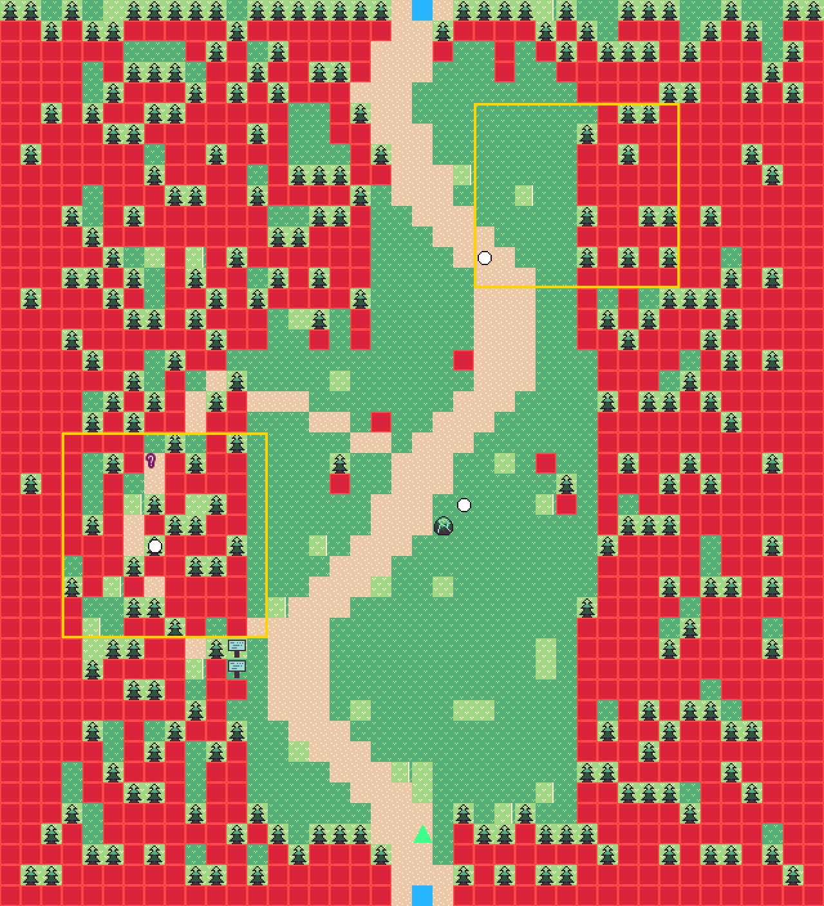

### In-game captures

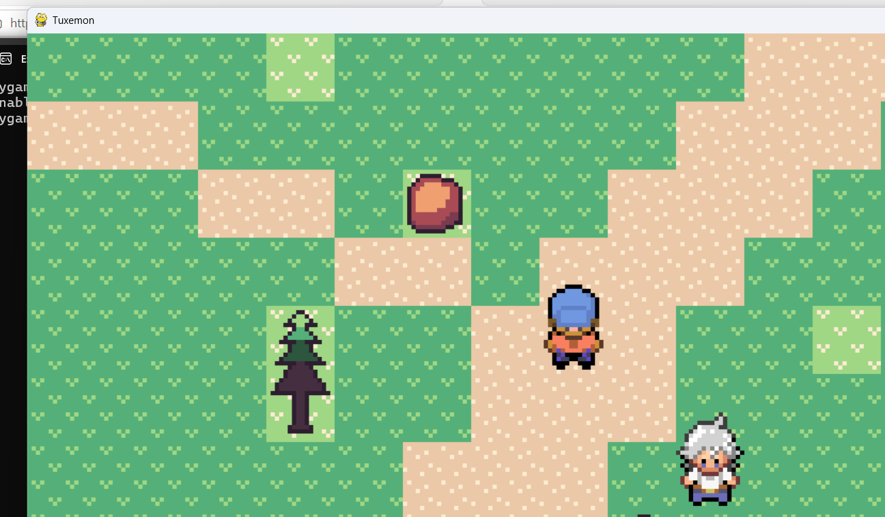

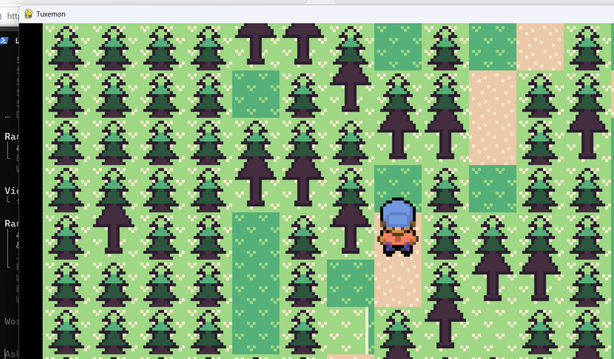
