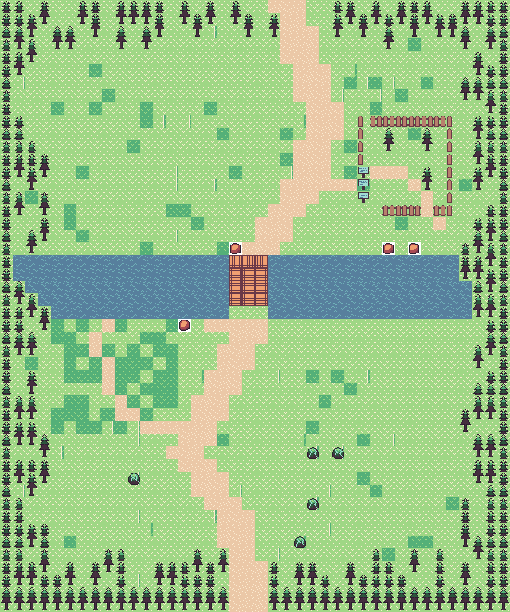
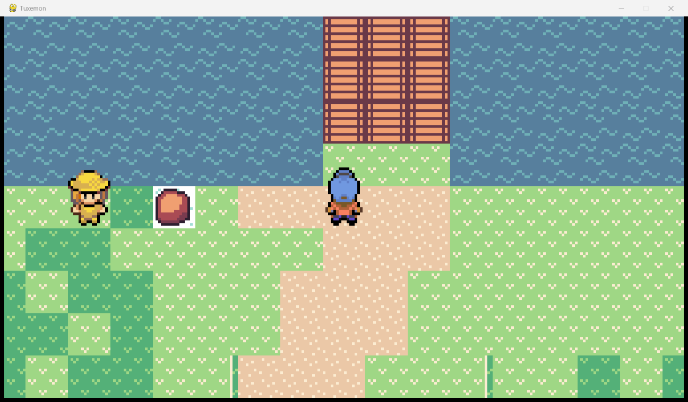

# Tuxemon Agentic World-Synthesis Experiment

This fork asks whether an AI coding agent can design an authored-feeling RPG
region when it reasons in landmarks, paths, activities and pacing, while a
deterministic compiler handles Tiled's mechanical tile/event representation.
It does not replace Tuxemon, its renderer, battle system or content database.

The first milestone is complete: **Glasswind Causeway** is one original,
playable route between the conceptual Fernwake and Brasshaven settlements.
The two small threshold maps exist only to prove paired transitions; they are
not claimed as completed settlements or as the requested 45–90 minute region.





The second research milestone adds one controlled **Deep Forest A/B/C
benchmark**. It does not expand the region. Three equivalent “Mossveil Passage”
maps compare deterministic procedural, unrevised one-shot, and structured
agentic workflows with the compiler and visual vocabulary held fixed.

## Pipeline

```text
region bible + WorldSpec YAML
           │
           ▼
Pydantic schema/reference validation
           │
           ▼
deterministic path, terrain, composition and collision compiler
           │
           ├──► Tuxemon TMX + NPC/encounter YAML
           ├──► canonical manifests and hashes
           ├──► full-map/debug PNG renders
           └──► reachability and structured critic reports
```

Authored intent lives in
`content/world_synthesis/glasswind_region.yaml`. Generated TMX and database
records live under `mods/world_synthesis/`; manifests, reports, critiques and
screenshots live under `artifacts/`. The JSON Schema is
`docs/world_synthesis/WORLD_SPEC_SCHEMA.json`.

## Setup and launch (Windows PowerShell)

Python 3.10–3.14 is supported by upstream; this milestone was run with Python
3.12.10.

```powershell
py -3.12 -m venv .venv
.\.venv\Scripts\python.exe -m pip install -e ".[test,world-synthesis]"
.\.venv\Scripts\python.exe -m world_synthesis build
.\.venv\Scripts\python.exe -m world_synthesis.play
```

The launcher deliberately creates an in-memory database overlay containing
the upstream `tuxemon` data and this experiment's `npc` and `encounter`
records. It does not modify upstream `mods/db_config.yaml` or the user's saved
configuration. Arrow keys move, Enter interacts, Escape opens/cancels menus,
and Shift sprints.

## Generate, validate and inspect

```powershell
# Rebuild TMX, manifests, reports, revision renders and critic history
.\.venv\Scripts\python.exe -m world_synthesis build

# Validation only (returns nonzero on blocking errors)
.\.venv\Scripts\python.exe -m world_synthesis validate

# Refresh the conservative asset catalogue
.\.venv\Scripts\python.exe -m world_synthesis catalog

# Focused experiment tests and static checks
.\.venv\Scripts\python.exe -m pytest tests\world_synthesis -q --no-cov
.\.venv\Scripts\ruff.exe check world_synthesis tests\world_synthesis
.\.venv\Scripts\mypy.exe --follow-imports=skip world_synthesis
```

Useful evidence:

- normal/debug side-by-side: `artifacts/map_renders/glasswind_causeway_inspection.png`
- validation: `artifacts/world_synthesis/reports/validation.txt` and `.json`
- deterministic decisions: `artifacts/world_synthesis/manifests/*.json`
- critic history: `artifacts/world_synthesis/critique/glasswind_causeway_revision_*.json`
- live screenshots: `artifacts/game_screenshots/`

Open generated `.tmx` files in Tiled if installed. Manual edits are useful for
experimentation but will be replaced on the next build; durable changes belong
in WorldSpec or a compiler primitive.

## What revision changed

Revision 1 had a readable route and the Singing Span, but no real exploration
loop, no counterweight landmark and a weakly staged secret. Revision 2 adds an
alder-bank loop that rejoins the road, the off-axis Warden's Grove, a visible
gap/sign clue, clustered river stones and zone-based vegetation variation.
Both renders and critic records are retained rather than overwriting the
evidence.

## A/B/C experiment status

The Deep Forest family is implemented and ready for blind human evaluation:

- A: competent deterministic procedural baseline;
- B: saved verbatim one-shot prompt and unrevised valid result;
- C: design reasoning → WorldSpec → compiler → validation/render → structural
  critique → one recorded content revision.

Build all three, then launch a method-masked session:

```powershell
.\.venv\Scripts\python.exe -m world_synthesis.benchmark build
.\.venv\Scripts\python.exe -m world_synthesis.benchmark play deep_forest
```

Close the game window after exploring; the launcher then asks the separate
human questionnaire. Do not inspect the method-revealing
`artifacts/world_synthesis/benchmark_gallery.md` before a blind session.
Results currently remain pending, so no method is declared the winner. See
`DEEP_FOREST_BENCHMARK_REPORT.md`, `GENERALIZATION_AUDIT.md`, and
`FAILURE_TAXONOMY.md` for evidence and limitations.

## Honest limitations

- The selected upstream prototype atlas is cohesive and legal within Tuxemon,
  but has basic path edges and limited prop variety; this is not final art.
- Static structural scoring cannot judge fun, encounter cadence or every
  moment-to-moment sightline. Human playtesting remains necessary.
- The frozen pine-heavy atlas makes all Deep Forest variants visually
  repetitive and may compress differences between design methods.
- NPC dialogue, battles, wild encounters, secret reward and warps are wired to
  real Tuxemon events, but the milestone is a route—not a complete narrative arc.
- Tiled was not installed in the inspected environment; generated maps were
  instead loaded through Tuxemon's real `TMXMapLoader` and launched in-game.
- The full suite is 4,261 passed / 1 pre-existing Windows-specific
  failure; see `TEST_REPORT.md` for the exact test and evidence.

See `TUXEMON_ARCHITECTURE.md`, `MAP_GRAMMAR.md`, `EVENT_GRAMMAR.md`,
`TILESET_CATALOG.md`, and `DECISIONS.md` for the archaeological evidence and
contracts behind the implementation.
